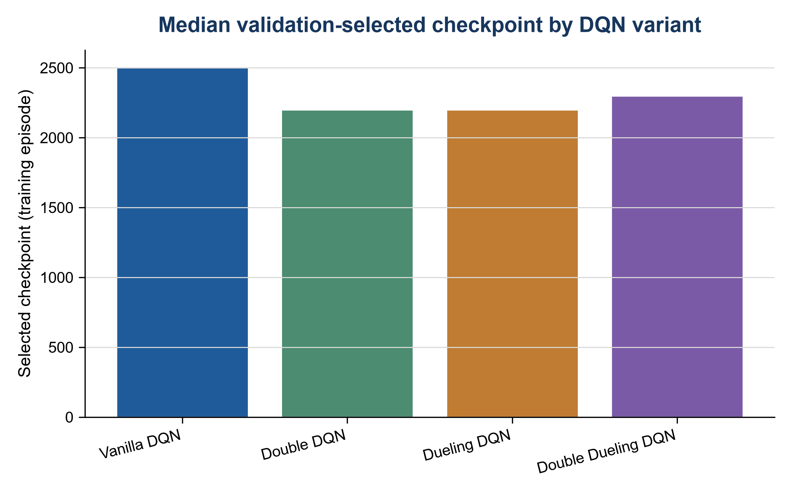

# Robotics & DQN — Visual Evidence Overview

This project brings together three evidence streams around intelligent robotic systems: a personal ROS1 navigation simulation, a team ROS2/TurtleBot3 physical-integration effort, and an independent DQN evaluation workflow. The streams are related by engineering concerns, but they are not one end-to-end ROS–FlappyBird system.

## At a glance

| Item | Summary |
|---|---|
| Question | What can be demonstrated separately about robot-system integration, navigation, and learning-based control evaluation? |
| My role | Implemented the personal ROS1 LiDAR/waypoint work; contributed to the team physical deployment; independently completed and evaluated the DQN workflow. |
| Main methods/system | ROS1, Gazebo, RViz, `move_base`; ROS2/TurtleBot3 context; seeded DQN training and held-out evaluation. |
| Key outcome | The controlled DQN study reports descriptive five-seed comparisons; Dueling DQN has the highest mean held-out success rate at 62.2%. |
| Evidence boundary | Simulation, team-owned physical evidence, and an independent FlappyBird-v0 experiment remain explicitly separated. |

## Evidence chain

```text
intelligent systems engineering
├── robotics systems
│   └── integration → sensing / navigation
└── learning-based control
    └── controlled DQN evaluation
```

### A — Personal ROS1 navigation

The first pair establishes what the personal robotics work actually covers. The RViz/Gazebo image shows the navigation context: map, scan, robot model, costmap, and path displays operating together. It is integration evidence for a ROS1 simulation, not evidence of a physical robot.


The terminal record answers the outcome question more directly: the `world_outer_loop.py` run records all nine waypoint goals as reached and then reports that the outer loop finished. The personal contribution was the sector-based LiDAR handling and waypoint client around the retained `move_base` setup. Together, the two views connect system context to a bounded multi-waypoint result.


This is a Gazebo simulation result. It does not establish physical-robot deployment, a new planning algorithm, or a complete autonomous target-selection-to-arrival system. The detailed implementation and evidence notes are in [ROS1 simulation](docs/ros1-simulation.md), [contributions](docs/contributions.md), and [evidence notes](docs/evidence-notes.md).

### B — Team physical integration

The second robotics stream comes from a team physical deployment with ROS2 Humble, TurtleBot3, Cartographer, and RViz. The retained image shows the navigation context hosted on the team system; it is useful for understanding the integration surface, while the accompanying contribution record defines what can be attributed to me.


My documented contribution includes assembly, hardware and networking work, robot–PC communication, mapping data, and goal-point movement. The result is team-owned: the image does not establish sole ownership, a continuous autonomous mission, or a complete physical deployment trace. See [team physical deployment](docs/team-physical-deployment.md) and [code attribution](docs/code-attribution.md) for the boundary.

### C — DQN final-test behaviour and seed variation

The DQN stream is independent of the ROS work. The controlled architecture study fixed the raw four-frame observation, reward, 3,000-episode budget, five paired training seeds, validation-selected checkpoints, and a 100-seed held-out final test. The distribution plot shows how final-test success varies across the five runs; the paired plot keeps the training seed matched while comparing architectures.


Dueling DQN had the highest five-run mean held-out test success rate, 62.2%. This is a descriptive result from five paired seeds, not a significance test and not a claim that Dueling is universally best. The controlled study should also remain distinct from the historical course result and its later standardized checkpoint re-evaluation. Those earlier records answer different evaluation questions and use different observation/evaluation contexts. [DQN training and evaluation](docs/dqn-training-and-evaluation.md), [the ablation study](docs/dqn-ablation-study.md), and the machine-readable [ablation summary](results/dqn/algorithm-ablation/configuration_summary.csv) preserve those distinctions.

### D — Performance versus complexity and selection behaviour

Final success is only one engineering criterion. The parameter-count comparison makes the structural cost visible: Vanilla and Double DQN use approximately 250k trainable parameters, while the Dueling variants use approximately 383k. The checkpoint-episode comparison answers a different question: when did validation select a checkpoint for each architecture?




Checkpoint episode is a validation-selection diagnostic, not a final-test ranking. Training time, parameter count, success rate, score, validation AUC, and seed-level spread should be read together. The full run-level and paired records are available under [DQN ablation results](results/dqn/algorithm-ablation/), with the public source subset in [src/dqn/README.md](src/dqn/README.md).

## Additional evidence

The remaining DQN figures are deliberately kept out of this short walkthrough. They answer narrower questions and remain available for inspection:

| Question | Evidence |
|---|---|
| How do mean scores vary across runs? | [Box mean score](figures/dqn/algorithm-ablation/box_mean_score.png) · [paired mean score](figures/dqn/algorithm-ablation/paired_mean_score.png) |
| What is the training-cost trade-off? | [Training time](figures/dqn/algorithm-ablation/training_time_comparison.png) |
| How does validation accumulate over training? | [Validation AUC](figures/dqn/algorithm-ablation/validation_auc_comparison.png) · [success curves](figures/dqn/algorithm-ablation/validation_success_curves.png) |
| Does validation median score tell the same story? | [Median-score curves](figures/dqn/algorithm-ablation/validation_median_score_curves.png) |
| Where are the public controls and limitations? | [DQN reproducibility](docs/dqn-reproducibility.md) · [limitations](docs/dqn-limitations.md) · [evaluation protocol](configs/dqn/evaluation_protocol.yaml) |

[Back to project README](README.md)
