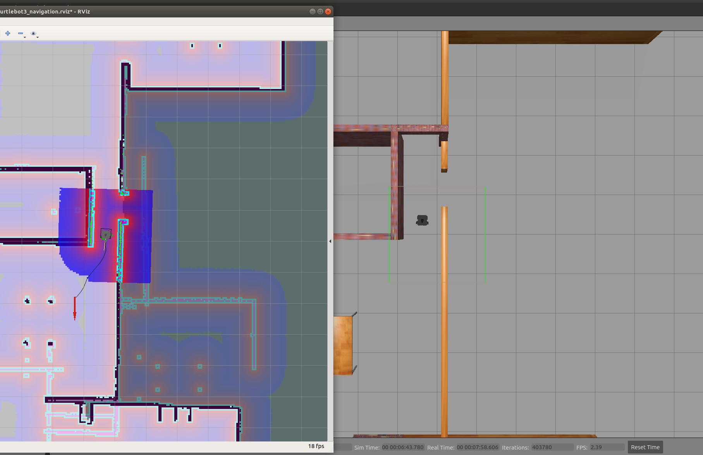
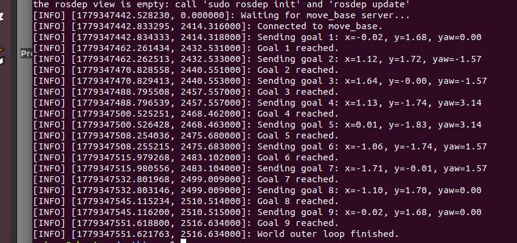

# Robotics & DQN

This project presents two related but independent workstreams: robotics systems engineering and learning-based control. They are kept separate because the ROS work and the FlappyBird DQN work are not one end-to-end system.

**Quick visual walkthrough:** [Evidence-led project overview](OVERVIEW.md)

## Executive view

| Workstream | Retained evidence | My role | Boundary |
|---|---|---|---|
| ROS1 simulation | Nine-goal multi-waypoint navigation in Gazebo using `move_base` | Implemented sector-based LiDAR handling and the waypoint client | Simulation result, not physical-robot evidence |
| Team physical TurtleBot3 | ROS2 Humble / Cartographer / RViz navigation context | Contributed to assembly, hardware, networking, robot–PC communication, mapping data, and goal-point movement | Team result; no sole-ownership or continuous autonomous-navigation claim |
| DQN control | Source subset, controlled observation/budget/architecture studies, validation-selected checkpoints, held-out tests | Independently completed the course implementation and later experimental workflow | FlappyBird-v0 evidence; no novel algorithm or generalisation claim |

## Robotics systems first

The main evidence is the separation between a personal ROS1 simulation and a team physical deployment:

- [ROS1 simulation](docs/ros1-simulation.md) — LiDAR, `cmd_vel`, `move_base`, Gazebo, and nine-goal evidence.
- [Team physical deployment](docs/team-physical-deployment.md) — contribution scope and the ROS2/TurtleBot3 boundary.
- [Evidence notes](docs/evidence-notes.md) — redacted RViz/Gazebo and terminal evidence.
- [Multi-waypoint result](results/robotics/multi-waypoint-navigation/result-summary.md) — concise result record.

## Learning-based control

The DQN material is a deeper technical evidence layer rather than the first visual entry point. It includes a historical course result, standardized checkpoint re-evaluation, observation and feature diagnostics, a training-budget study, and a four-architecture ablation.

| Result | Retained conclusion |
|---|---|
| Observation study | `raw_4frame` was the most useful tested representation for later studies; engineered features showed redundancy concerns |
| Architecture study | Dueling DQN had the highest five-run mean test success rate (62.2%) in the tested configuration |
| Trade-off | Double DQN had lower cross-run variation and training time; lower-complexity choices remain relevant |
| Historical checkpoint | The archived 36/50 result and later 100-episode re-evaluation are distinct evidence streams |

Detailed DQN figures, tables, configurations, and source are retained here:

- [DQN system](docs/dqn-system.md)
- [Training and evaluation](docs/dqn-training-and-evaluation.md)
- [Ablation study](docs/dqn-ablation-study.md)
- [Final experimental report](docs/dqn-final-experimental-report.md)
- [Public DQN source subset](src/dqn/README.md)

## Evidence and limits

The project does not claim a combined ROS–FlappyBird system, a new navigation stack, a novel DQN method, sole ownership of team robot work, or complete autonomous physical deployment. DQN comparisons are descriptive and specific to FlappyBird-v0, the retained reward/training settings, and the stated seed protocols.

For the full evidence layer, see [evidence](docs/evidence.md), [contributions](docs/contributions.md), and [limitations](docs/limitations.md).

## Public structure

- `src/` — selected ROS1 package files and inspected DQN source components.
- `configs/` — simulation maps and DQN configuration snapshots.
- `results/` — machine-readable summaries and result records.
- `figures/` — redacted robotics evidence and CSV-derived DQN figures.
- `docs/` — attribution, evidence, reproducibility, safety, limitations, and technical notes.
