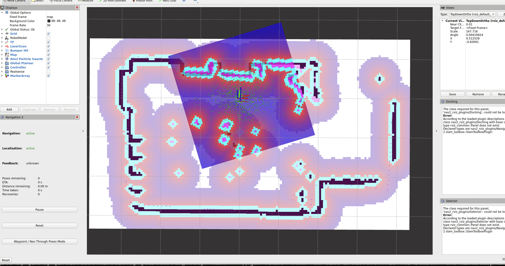

# Evidence Notes / 证据说明

## ROS1 simulation media

- `ros1_rviz_gazebo_integration_redacted.png` shows concurrent RViz and Gazebo context, including map, scan/model, costmap, and path displays. It is integration evidence only.

- `ros1_nine_goal_terminal_evidence_redacted.png` preserves the terminal lines for Goals 1–9 and `World outer loop finished`. It is the primary public evidence for the nine-goal simulation result.

## Team physical media

- `team_nav2_context_redacted.png` is a team-based Navigation2/RViz context screenshot from an environment hosted on a teammate's computer. It shows navigation/localization context but no robot body or continuous target-selection-to-arrival trace.

## Excluded evidence

Raw logs, unredacted screenshots, physical mapping screenshots, and the physical-robot video remain private. The team reports that the video documents manual teleoperation and RViz goal-directed movement; the currently released public evidence does not independently verify a continuous target-selection-to-arrival sequence.
