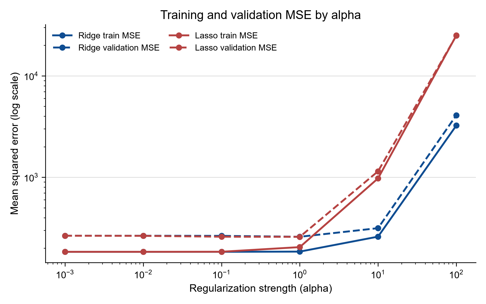
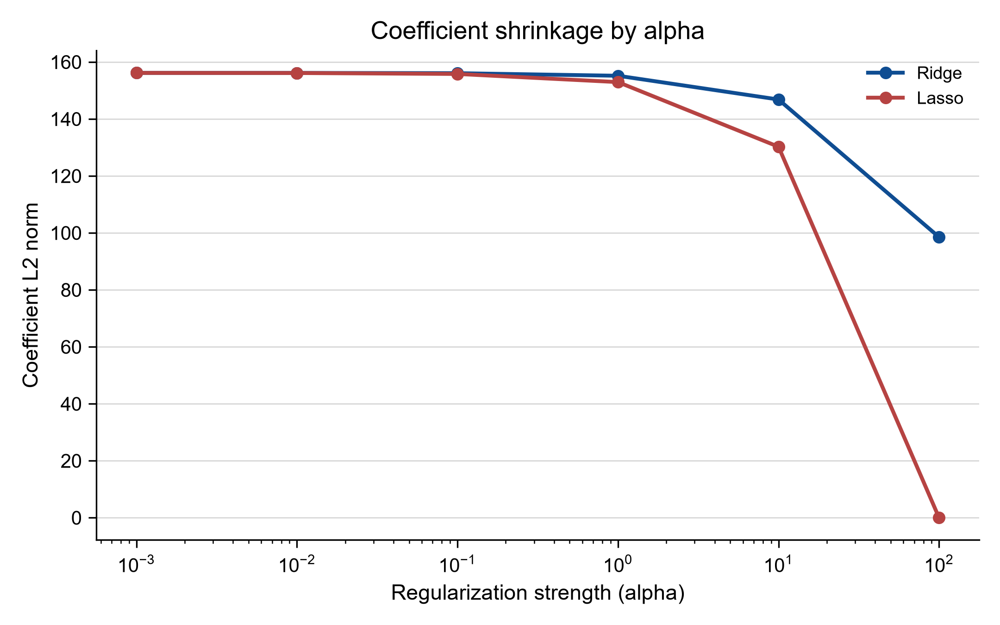
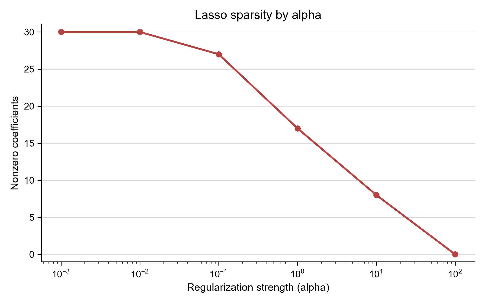
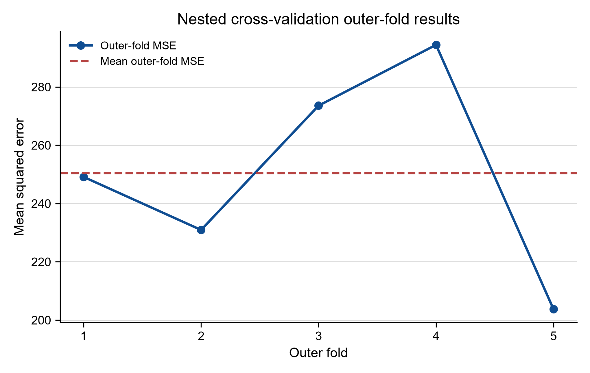

# Machine Learning Evaluation — Visual Evidence Overview

This project asks how to evaluate regularized regression without letting the test set influence model selection, and how to estimate the performance of the selection procedure rather than treating one fitted model as the whole experiment.

## At a glance

| Item | Summary |
|---|---|
| Question | How should alpha selection and its uncertainty be evaluated? |
| My role | Implemented the simulated-data experiment, split discipline, Ridge/Lasso comparison, and nested cross-validation workflow. |
| Main methods/system | `make_regression`, 60/20/20 train/validation/test split, train-only scaling, Ridge/Lasso, 5×3 nested CV. |
| Key outcome | Validation-selected alpha is evaluated once on held-out data; nested CV shows variation across the full selection procedure. |
| Evidence boundary | The data are synthetic and generated at runtime; this is a methods demonstration, not a real prediction study. |

## Evidence chain

```text
simulated regression data
          ↓
60/20/20 split
          ↓
train-only scaling
          ↓
validation-based alpha selection
          ↓
one-time held-out test
          ↓
shrinkage / sparsity interpretation
          ↓
nested CV and selection uncertainty
```

### A — Selection without test leakage

The first block fixes the decision boundary. The experiment generates 300 samples with 30 features, eight informative features, noise level 15, and seed 42. The data are split into training, validation, and test partitions at 60%/20%/20%. `StandardScaler` is fitted on the training features only, then applied to validation and test data. Alpha is selected by validation MSE; the held-out test set is consulted once after that choice.



The figure shows the six candidate alpha values on a logarithmic axis and keeps training and validation error visible together. The important result is the separation of roles: validation supports the choice, while the test partition estimates the selected model after the choice has been made. There is no test sweep in this workflow. The exact candidate rows are in [Ridge/Lasso metrics](results/ridge_lasso_metrics.csv), and the implementation is in [ridge_lasso_experiment.py](src/ridge_lasso_experiment.py).

### B — What regularization changes

The next two views explain what the penalties do beyond their MSE curves. Ridge contracts coefficients continuously as alpha grows. Lasso can also set coefficients exactly to zero, making the relationship between regularization strength and sparsity explicit.





In the verified run, both models select alpha 1.0 by validation MSE. Ridge has validation MSE 259.1249 and 30 nonzero coefficients; Lasso has validation MSE 258.7168 and 17 nonzero coefficients. Their one-time held-out test MSE values are 256.7029 and 252.0955 respectively. These numbers describe this simulated configuration; the project's value is not that Lasso wins by a small margin, but that error, coefficient behaviour, and selection procedure are kept interpretable.

The coefficient and sparsity records are summarized in [ridge_lasso_summary.csv](results/ridge_lasso_summary.csv). The broader methodological boundary is documented in [methodology](docs/methodology.md) and [project notes](docs/project_notes.md).

### C — Why one selected alpha is not the whole story

The final block repeats the selection logic inside a nested design. A 5-fold outer loop estimates the performance of fitting and selecting together. Inside each outer training partition, a 3-fold `GridSearchCV` selects alpha through a `Pipeline(StandardScaler(), Ridge())`, so scaling is refit within each fold.



The five outer-fold MSE values are 249.1269, 230.9320, 273.5815, 294.4485, and 203.7464, with mean 250.3671 and sample SD 35.4783. The selected inner alphas vary across folds: 1.0, 0.001, 0.001, 1.0, and 0.1. That variation is the central evidence in this block: a single selected alpha and a single test score do not fully describe the uncertainty of the selection procedure.

The machine-readable records are [nested fold results](results/nested_cv_fold_results.csv) and [nested CV summary](results/nested_cv_summary.csv). The runnable demonstration is [nested_cv_demo.py](src/nested_cv_demo.py), while tested package and environment information is recorded in [reproducibility](docs/reproducibility.md).

## Interpretation and scope

Because the data are generated with `make_regression`, these figures demonstrate evaluation methodology rather than performance on a real scientific or business problem. This overview is a faster visual interpretation of the existing experiment. It should not be read as a general winner between Ridge and Lasso, or a guarantee that the selected configuration will transfer outside this generated setting.

Read the figures from left to right as different questions rather than as one scorecard: the first plot governs the selection decision, the next two explain the structural consequence of that decision, and the final plot tests how much the selection result moves across outer folds. That separation is the reproducibility lesson the overview is intended to make visible.

[Back to project README](README.md)
