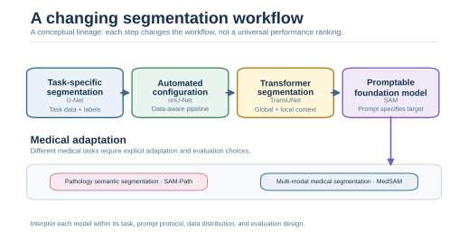
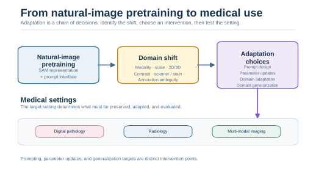
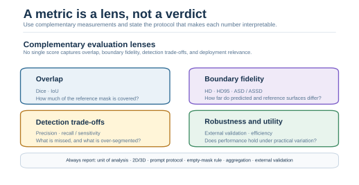

# Medical Image Segmentation with Foundation Models — Visual Evidence Overview

This project is a literature-based technical review of how promptable foundation models meet medical-image domain shift, and how adaptation and evaluation choices determine whether a reported segmentation claim is interpretable.

## At a glance

| Item | Summary |
|---|---|
| Question | What transfers from natural-image foundation models to medical segmentation, and what must be adapted or checked? |
| My role | Built an evidence-led literature synthesis, original conceptual schematics, comparison tables, and a bounded future inference plan. |
| Main methods/system | U-Net-family and Transformer context, SAM, SAM-Path, MedSAM, adaptation taxonomy, metric validity. |
| Key outcome | Medical transfer is a chain of domain, prompt, adaptation, and evaluation decisions rather than a universal model ranking. |
| Evidence boundary | No patient-data experiment, training, fine-tuning, checkpoint, or project-generated medical metric is included. |

## Evidence chain

```text
task-specific segmentation
          ↓
promptable foundation models
          ↓
medical domain shift
          ↓
adaptation choices
          ↓
evidence and evaluation validity
```

### A — From task-specific segmentation to SAM

The first schematic places promptable foundation models in context. U-Net represents task-specific segmentation; nnU-Net emphasizes automated configuration; TransUNet represents a Transformer-enhanced segmentation path; SAM changes the interaction model by making the target promptable. The sequence is conceptual lineage, not a performance leaderboard.



SAM-Path and MedSAM appear as examples of medical settings that use the foundation-model idea differently. Their tasks, data, prompts, and adaptation mechanisms must remain attached to their individual papers. The detailed model discussion and source links are in [technical review](docs/technical_review.md) and [model comparison](tables/model_comparison.md).

### B — Why medical transfer requires adaptation

Natural-image pretraining provides a representation and a prompt interface, but medical images introduce differences in modality, scale, dimensionality, contrast, scanner or stain, annotation ambiguity, and target semantics. The second schematic makes that transfer problem explicit and separates prompt design, parameter updates, domain adaptation, and domain generalization.



SAM-Path illustrates a pathology-specific adaptation setting with class prompts and a pathology encoder. MedSAM illustrates a broader multi-modal medical setting with box prompts. They are informative examples of different intervention points, not entries in a unified ranking. The review records the study context for reported numbers rather than converting them into a cross-paper comparison.

### C — Why metric context determines whether a claim is meaningful

The last schematic moves from model choice to evaluation design. Dice and IoU describe overlap; HD, HD95, and ASD/ASSD describe surface discrepancy; precision and recall expose different false-positive and false-negative trade-offs; external validation and efficiency ask whether the result remains useful under practical variation.



No single score captures all of these lenses. A meaningful claim also states the unit of analysis, 2D-versus-3D setting, prompt protocol, empty-mask rule, aggregation method, label definition, and whether the test set is external. [Evaluation metrics](tables/evaluation_metrics.md) gives the reporting cautions, while [claim evidence summary](tables/claim_evidence_summary.md) keeps each public statement tied to its qualification.

## Scope and next step

The three diagrams are original conceptual syntheses created for this repository; they are not redrawn paper figures. [Literature scope](docs/literature_scope.md) records the focused 14-source review and its exclusions.

The next valid step would be a small, transparent inference study using a public licensed dataset, documented weights, fixed preprocessing and prompts, and matching ground truth. That is a future plan in [reproducibility plan](docs/reproducibility_plan.md), not a result of this project.

[Back to project README](README.md)
