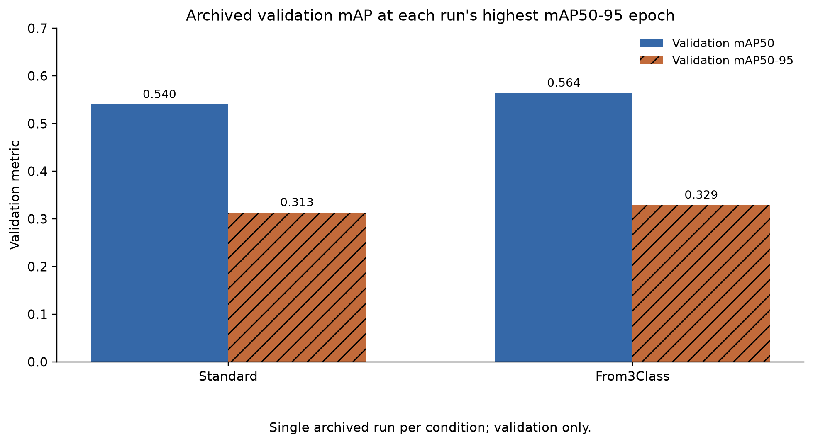
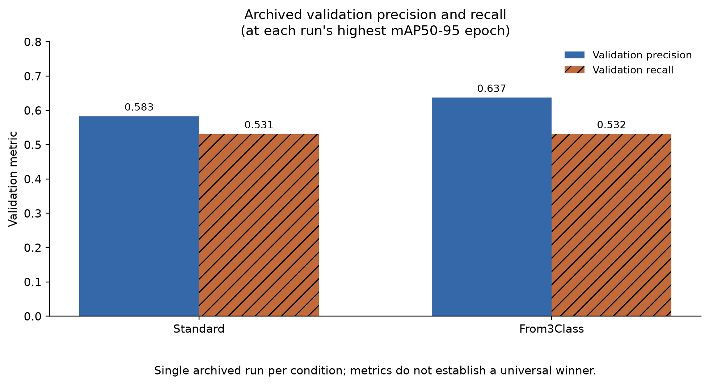
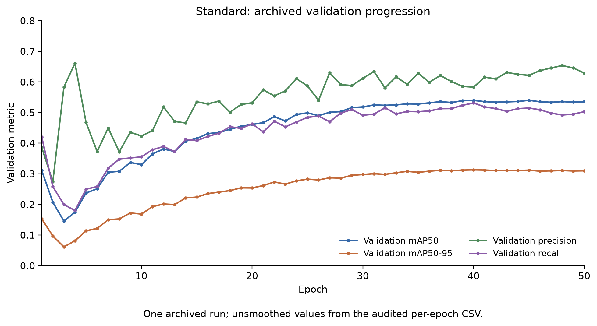
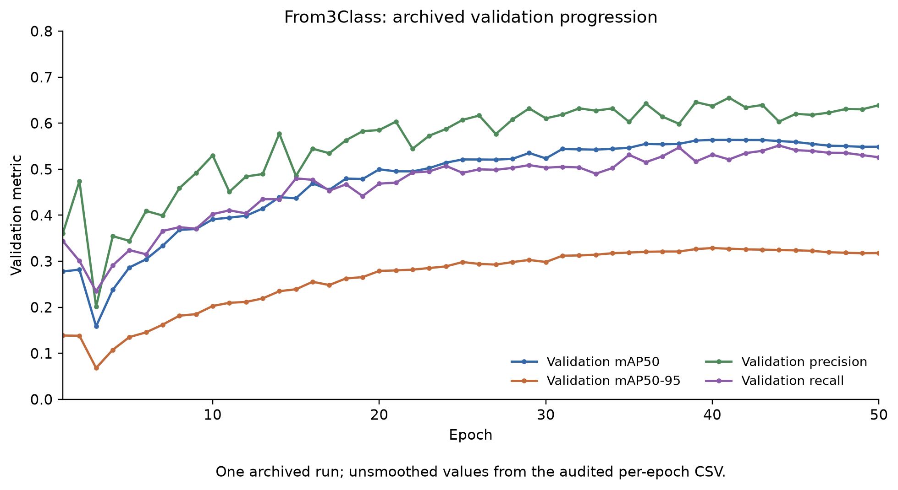
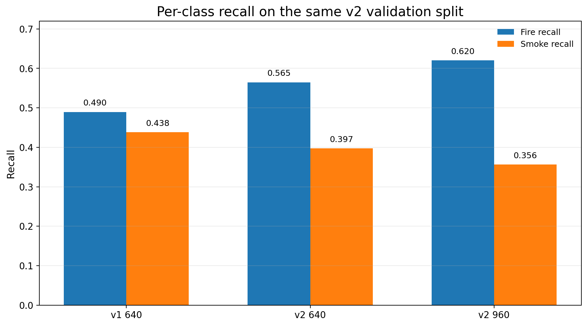
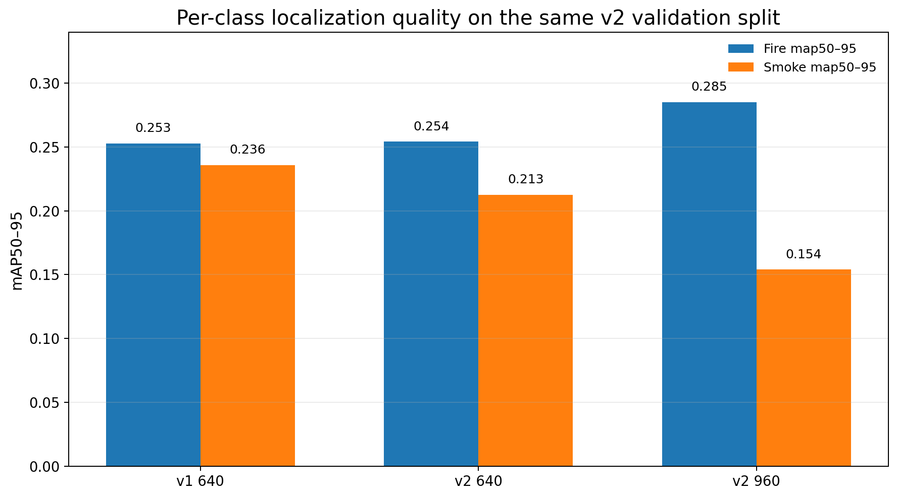
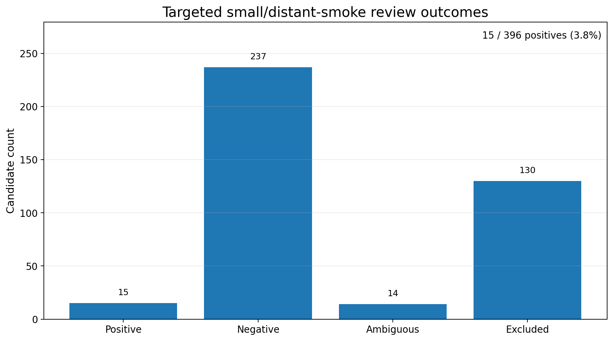

# Fire and Smoke Detection for Forest Monitoring

*An evidence-led project that evolved from an archived five-class YOLO11 comparison into a current two-class fire/smoke engineering workflow.*

## Project overview

This repository records two stages of the same broader forest-monitoring problem.

The earlier stage examined how different YOLO11 initialization paths behaved in a five-class detection task. That work established the first audited experimental baseline and clarified the limits of the surviving training records. The current stage narrows the task to the two safety-critical classes, `fire` and `smoke`, and shifts the engineering focus toward data governance, class-specific failure analysis, difficult-smoke coverage, and scene/event independence.

The two stages are connected by problem domain and methodology, but they are **not numerically comparable**. Their datasets, label spaces, split histories, checkpoint lineages, and evaluation protocols differ.

| Stage | Label space | Main question | Role in this project |
|---|---|---|---|
| Earlier experimental foundation | `fire`, `smoke`, `animal`, `person`, `vehicle` | How did Standard and From3Class YOLO11 initialization behave under the retained five-class setup? | Establishes the initial experimental and audit framework |
| Current engineering development | `fire`, `smoke` | How should the detector be improved when aggregate metrics can rise while smoke recall and localization quality decline? | Develops the present fire/smoke data and evaluation workflow |

---

## Executive view

| Item | Summary |
|---|---|
| **Problem** | Improve a forest-monitoring detector without mistaking a higher aggregate score for uniform fire/smoke performance. |
| **My role** | Rechecked retained records, separated evaluation contexts, prepared public tables and figures, and documented data-governance and contribution boundaries. The archive does not assign every remote training action to one person. |
| **Scale** | Earlier five-class archive: 22,899 images. Current two-class development manifests: 424 images (v1) and 656 images (v2). |
| **Technical workflow** | Source-media and duplicate review → annotation and scene/event checks → same-split checkpoint evaluation → per-class diagnosis → targeted difficult-smoke review → next-model planning. |
| **Key findings** | v2-640 raised mAP50 over v1 by 0.0091 but lowered mAP50-95 by 0.0109; v2-960 further reduced smoke recall and did not improve the overall result. |
| **Engineering outcome** | Retain v1 as the published development baseline because the higher overall recall at 960 was driven by fire, not a uniform improvement across both classes. |
| **Evidence boundary** | Validation/development evidence only: no released dataset, independently audited test benchmark, video-level alert evaluation, or deployment-readiness claim. |

---

# Stage I — Earlier five-class experimental foundation

## Initial experimental question

The archived study asked:

> Under the retained training setup, how did a standard YOLO11s initialization compare with continued training from a three-class checkpoint after moving to a five-class forest-monitoring dataset?

The five classes were `fire`, `smoke`, `animal`, `person`, and `vehicle`. This was an experimental object-detection comparison, not an operational fire-warning system.

Both retained conditions requested 50 epochs with image size 640, batch size 16, seed 0, and the same archived dataset path. The Standard condition started from `yolo11s.pt`; From3Class continued from an archived three-class checkpoint. Because initialization and resume state differ, the evidence supports a partially controlled comparison rather than a strict ablation.

## Archived dataset and evaluation scope

The retained clean dataset contains 22,899 images with matching YOLO label files:

| Split | Images |
|---|---:|
| Train | 16,459 |
| Validation | 2,002 |
| Test-designated | 4,438 |

No independently audited evaluation record for the test-designated split was found. The public results below therefore come from records marked `split: val`.

The dataset is not released because source licences, merged-data provenance, redistribution rights, and privacy review are incomplete. Person and vehicle imagery may include faces, licence plates, or surveillance contexts. See [data governance](docs/data_governance.md).

## Retained validation result

The reporting rule selects, for each condition, the epoch with the highest archived validation mAP50-95. It does not combine peak values from different epochs.

| Condition | Selected epoch | Precision | Recall | Validation mAP50 | Validation mAP50-95 |
|---|---:|---:|---:|---:|---:|
| Standard | 40 | 0.58295 | 0.53123 | 0.53969 | 0.31296 |
| From3Class | 40 | 0.63734 | 0.53157 | 0.56365 | 0.32864 |





Under this selection rule, From3Class records higher validation precision and mAP values, while recall is nearly unchanged. With one retained run per condition and no verified evaluation of the test-designated split, the result is treated as promising in this archived setup rather than generally superior.

At epoch 50, Standard records precision 0.62883, recall 0.50296, mAP50 0.53512, and mAP50-95 0.30997. From3Class records precision 0.63911, recall 0.52584, mAP50 0.54876, and mAP50-95 0.31786. Full best-epoch and final-epoch values remain available in [the archived validation table](tables/validation_results.md).





## What this stage established

The earlier study contributed more than a pair of validation scores. It established several practices that were carried into the current work:

- use a declared metric-selection rule instead of reporting whichever individual values look strongest;
- separate retained evidence from reconstruction or inference;
- distinguish validation observations from independent benchmark claims;
- document data provenance, privacy, contribution, and reproducibility boundaries;
- preserve scripts that rebuild public figures from sanitized tables rather than publishing restricted assets.

It also exposed limitations that a model-only comparison could not resolve: incomplete dataset provenance, one run per condition, no repeated-seed uncertainty, no independent test-designated evaluation, and insufficient visibility into class-specific failure modes.

Those limitations motivated the next stage.

---

# Transition — From model comparison to fire/smoke engineering

The current two-class track is not a direct continuation of the five-class experiment at the dataset or checkpoint level. It evolved from the same forest-monitoring problem, but narrowed the label space to `fire` and `smoke` and changed the main engineering question.

Instead of asking only which initialization produces the stronger aggregate validation score, the current work asks whether the data, class behavior, split construction, and retained evidence are strong enough to support the next model decision.

| Dimension | Earlier five-class study | Current two-class development |
|---|---|---|
| Primary purpose | Compare initialization paths | Build and diagnose a fire/smoke development baseline |
| Label space | Five monitoring classes | Two safety-critical classes |
| Main evidence | Archived training records | Data governance, retained checkpoints, class metrics, and review records |
| Evaluation emphasis | Aggregate validation comparison | Same-split checkpoint evaluation and per-class behavior |
| Main limitation exposed | Experimental and provenance incompleteness | Smoke recall, localization quality, difficult-target coverage, and split independence |
| Relationship between stages | Methodological foundation | Present engineering track |

The earlier study therefore serves as an **experimental foundation**, not as a numerical baseline for the current detector.

---

# Stage II — Current two-class engineering development

## Engineering objective

The current stage asks:

> How should a fire/smoke detector be improved when aggregate metrics can rise while smoke recall and localization quality decline?

The workflow treats source-media governance, annotation review, class-specific behavior, scene/event independence, and difficult-target analysis as part of model development rather than relying on one aggregate score.

## Data governance and dataset evolution

The retained workflow includes source-media registration, SHA-256 exact-duplicate control, modality and semantic review, annotation review, temporal grouping, scene/event adjudication, and cluster-aware split planning.


Two retained manifests support the following development snapshots:

| Dataset | Total | Train | Validation | Test-designated | Positive | Negative | Fire boxes | Smoke boxes |
|---|---:|---:|---:|---:|---:|---:|---:|---:|
| Development v1 | 424 | 296 | 86 | 42 | 267 | 157 | 762 | 177 |
| Development v2 | 656 | 457 | 132 | 67 | 426 | 230 | 1,041 | 332 |


These figures describe retained development manifests. They do not constitute a public dataset release, and the test-designated subsets are not presented as independently audited benchmarks. A formal scene/event freeze for every retained version is not claimed.

## Same-split checkpoint evaluation

For a controlled checkpoint comparison, the retained v1, v2-640, and v2-960 `best.pt` checkpoints were evaluated on the same v2 validation split.

| Checkpoint | Selected checkpoint epoch | Precision | Recall | mAP50 | mAP50-95 |
|---|---:|---:|---:|---:|---:|
| Development v1 — 640 | 33 | 0.5738 | 0.4640 | 0.4777 | 0.2443 |
| Development v2 — 640 | 50 | 0.5621 | 0.4810 | 0.4868 | 0.2334 |
| Development v2 — 960 | 50 | 0.5264 | 0.4883 | 0.4463 | 0.2196 |


The v2-640 checkpoint increased mAP50 by 0.0091 relative to v1, but mAP50-95 decreased by 0.0109. The v2-960 checkpoint recorded lower mAP50 and mAP50-95 than v2-640. Increasing input resolution alone therefore did not produce a stronger overall result.

The retained v1 training record contains 48 completed epochs from a requested 50; its selected checkpoint corresponds to epoch 33. The table reports coherent checkpoint evaluations rather than combining the strongest value of each metric from different epochs.

## Per-class behavior and baseline decision

The class-level results explain why overall recall alone is insufficient.

| Checkpoint | Fire recall | Smoke recall | Fire mAP50-95 | Smoke mAP50-95 |
|---|---:|---:|---:|---:|
| Development v1 — 640 | 0.4897 | 0.4384 | 0.2527 | 0.2358 |
| Development v2 — 640 | 0.5648 | 0.3973 | 0.2542 | 0.2125 |
| Development v2 — 960 | 0.6204 | 0.3562 | 0.2852 | 0.1540 |





From v1 to v2-640, fire recall increased by 0.0751 while smoke recall decreased by 0.0411. Moving from v2-640 to v2-960 increased fire recall again but reduced smoke recall by another 0.0411. The higher overall recall at 960 is therefore driven by fire rather than a uniform improvement across both classes.

Because the development objective includes smoke sensitivity and localization quality, v1 remains the retained development baseline for this published snapshot.

## Training progression

The v1 curve below is its native training history on the v1 dataset and should not be interpreted as a same-split curve against v2.


The two v2 runs used the same dataset, so their native training curves can be compared more directly:


Training-time curve maxima are not substituted for the checkpoint evaluations reported above. A public long-format CSV is included so the plotted progression remains inspectable.

## Targeted small and distant smoke review

A targeted review screened 396 candidate samples:

| Outcome | Count |
|---|---:|
| Positive | 15 |
| Negative | 237 |
| Ambiguous | 14 |
| Excluded | 130 |

The 15 positives consisted of 10 clear full-view cases and 5 zoom-dependent cases, with 16 retained smoke boxes. The positive yield was approximately 3.8%.



A separate 40-image Pyro-SDIS pilot produced no usable positive sample. Continued expansion from that source was stopped as a positive-yield engineering decision rather than continued without evidence of value.

## Error-analysis boundary

The retained diagnostic materials include full-image, crop-based, and tiled-inference analysis. However, the formal A–E category definitions and denominator are not fully reconciled: one retained summary reports A=16, B=11, C=0, D=3, and E=4, while a separate note mentions seven visually ambiguous or information-insufficient targets without establishing whether they overlap.

No A–E distribution is therefore published. The supported conclusion is narrower: the 960-pixel experiment did not resolve the retained small/distant-smoke limitation, and additional data review was more informative than assuming resolution alone would solve it.

## Scene and event independence

The workflow reviews temporal proximity, repeated camera views, physical-event overlap, and conservative scene/event clusters before split planning. Retained evidence confirms that a 24-group novelty adjudication was completed, but it does not establish final formal acceptance or dataset freezing.

These controls reduce leakage risk; they do not prove that every retained split is an independent benchmark.

## Published snapshot and next steps

The public evidence currently supports:

- two-class YOLO11s development runs at v1-640, v2-640, and v2-960;
- a same-v2-validation checkpoint comparison;
- class-level fire/smoke metrics;
- targeted small/distant-smoke review;
- Pyro-SDIS pilot closeout;
- retained scene/event and novelty-review work as development evidence.

The following are not presented as complete:

- formal diversity-24 acceptance and freeze;
- a frozen development-v3 dataset;
- development-v3 training;
- video-level evaluation;
- temporal confirmation, confidence hysteresis, and alert cooldown;
- deployment readiness.

The next planned model-evaluation sequence is:

1. YOLO26s as the next baseline;
2. D-FINE-S as a cross-architecture challenge;
3. RT-DETRv2-S as a stable Transformer comparison.

No result is claimed for these models until retained training and evaluation evidence is available.

## Reproducibility and publication boundary

The public two-class materials include sanitized aggregate tables, per-class metrics, dataset statistics, training curves, and figure-generation code. They do not include source media, labels, model weights, review databases, internal paths, credentials, or unreviewed qualitative images.

The two-class figures can be rebuilt from the public CSV files:

```powershell
python src\build_two_class_figures.py
```

The archived five-class figures can be rebuilt from their retained public tables:

```powershell
python -m pip install -r requirements.txt
python src\build_figures.py
```

These scripts rebuild public figures only. They do not reproduce model training, validation, or inference.

---

## Repository guide

### Earlier five-class foundation

- [`results/`](results/): audited archived validation tables and per-epoch metrics.
- [`figures/`](figures/): archived and current figures regenerated from public CSV files.
- [`tables/`](tables/): readable condition, result, and evidence summaries.
- [`docs/experiment_scope.md`](docs/experiment_scope.md): archived scope and non-claims.
- [`docs/methodology.md`](docs/methodology.md): metric-selection and audit method.
- [`docs/data_governance.md`](docs/data_governance.md): data, privacy, and leakage boundary.
- [`docs/contribution_scope.md`](docs/contribution_scope.md): evidence-based attribution boundary.
- [`docs/reproducibility.md`](docs/reproducibility.md): what the archived study can and cannot reproduce.

### Current two-class development

- [`results/two_class_checkpoint_metrics.csv`](results/two_class_checkpoint_metrics.csv): coherent checkpoint results on the same v2 validation split.
- [`results/two_class_per_class_metrics.csv`](results/two_class_per_class_metrics.csv): fire/smoke precision, recall, mAP50, and mAP50-95.
- [`results/two_class_dataset_statistics.csv`](results/two_class_dataset_statistics.csv): retained v1/v2 dataset counts.
- [`results/two_class_training_curves.csv`](results/two_class_training_curves.csv): long-format native training histories.
- [`results/two_class_targeted_smoke_review.csv`](results/two_class_targeted_smoke_review.csv): targeted review outcomes.
- [`src/build_two_class_figures.py`](src/build_two_class_figures.py): rebuilds current-development figures from public CSV files.
- [`docs/two_class_development_scope.md`](docs/two_class_development_scope.md): current evidence and non-claim boundaries.
