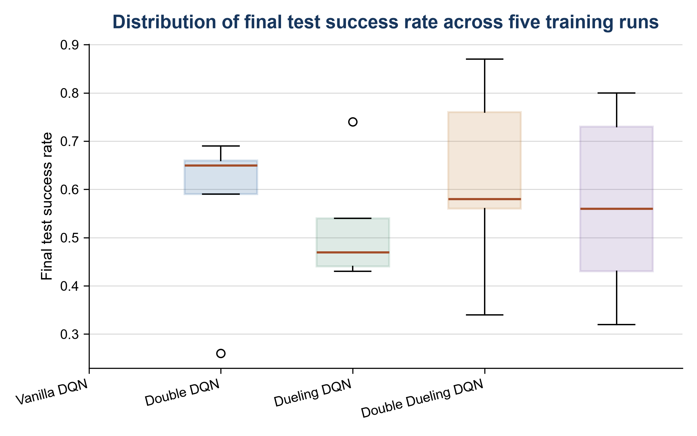
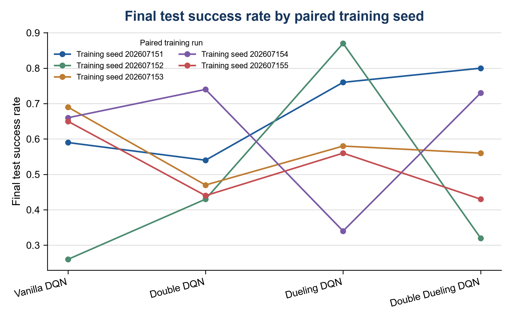
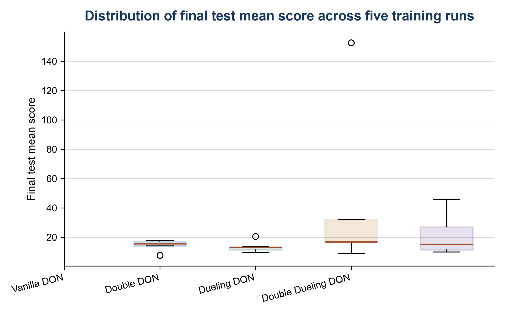
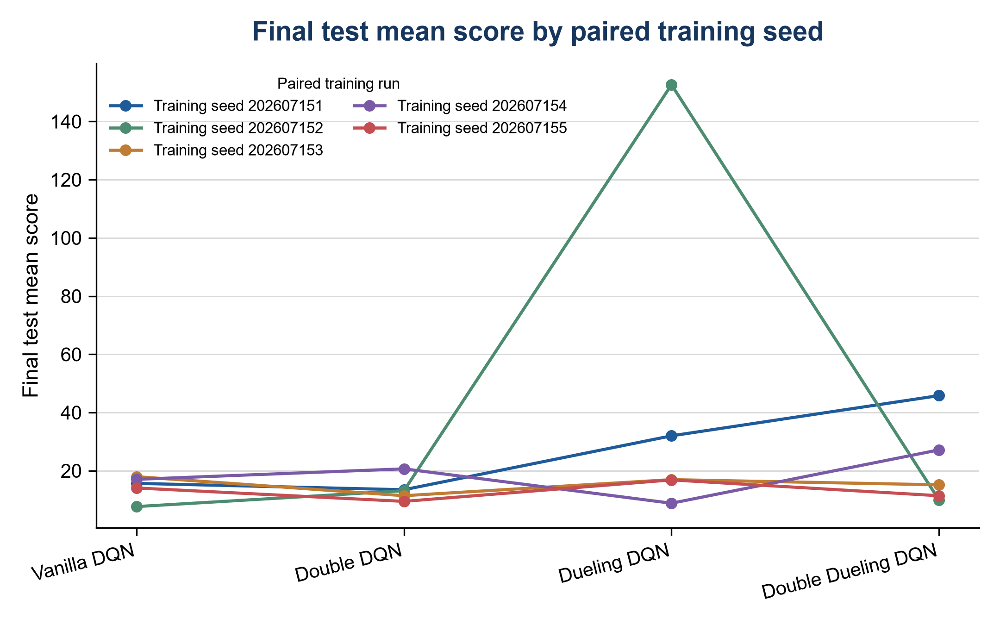
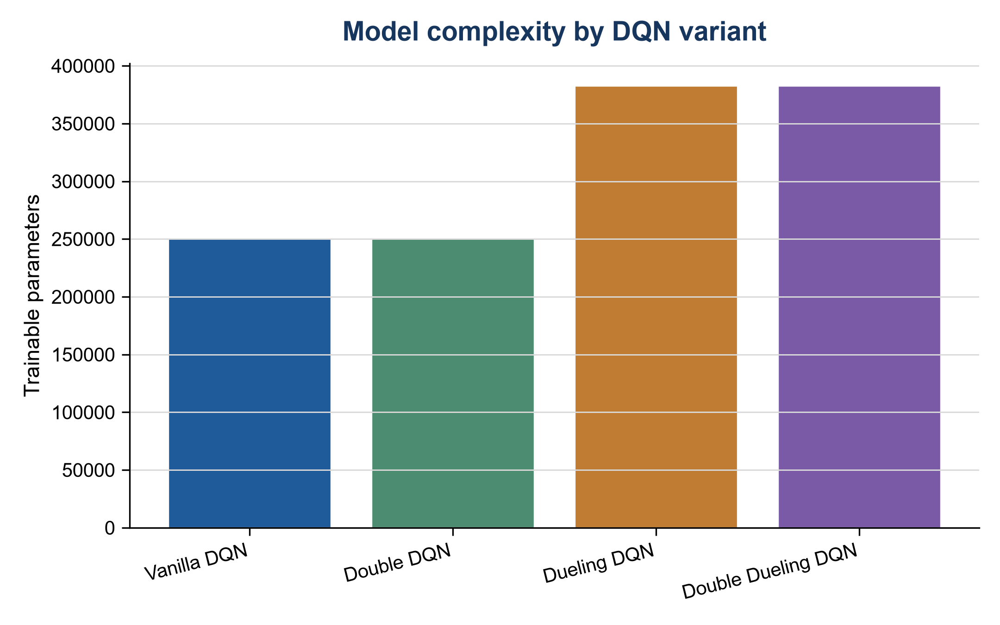
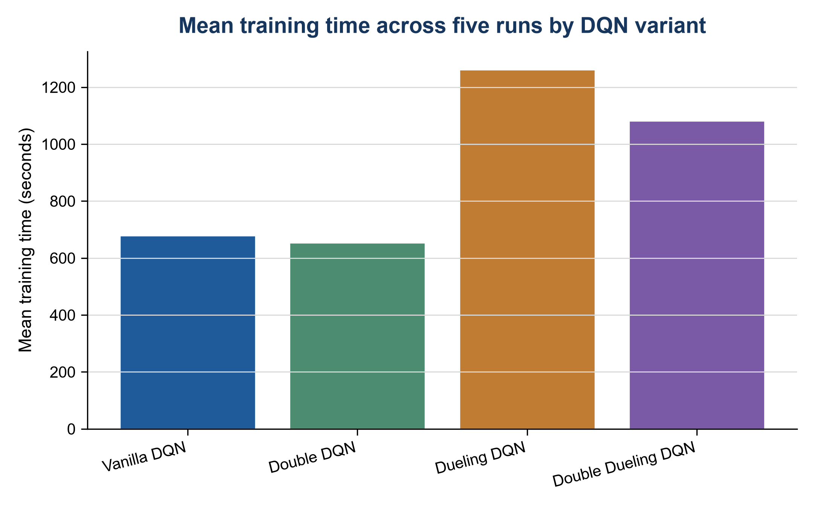
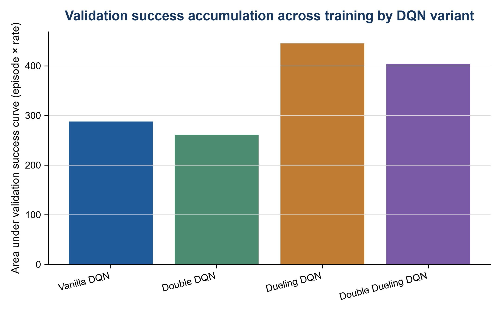
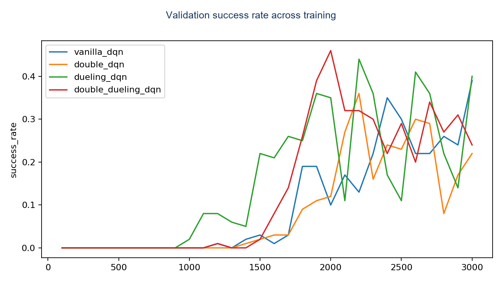
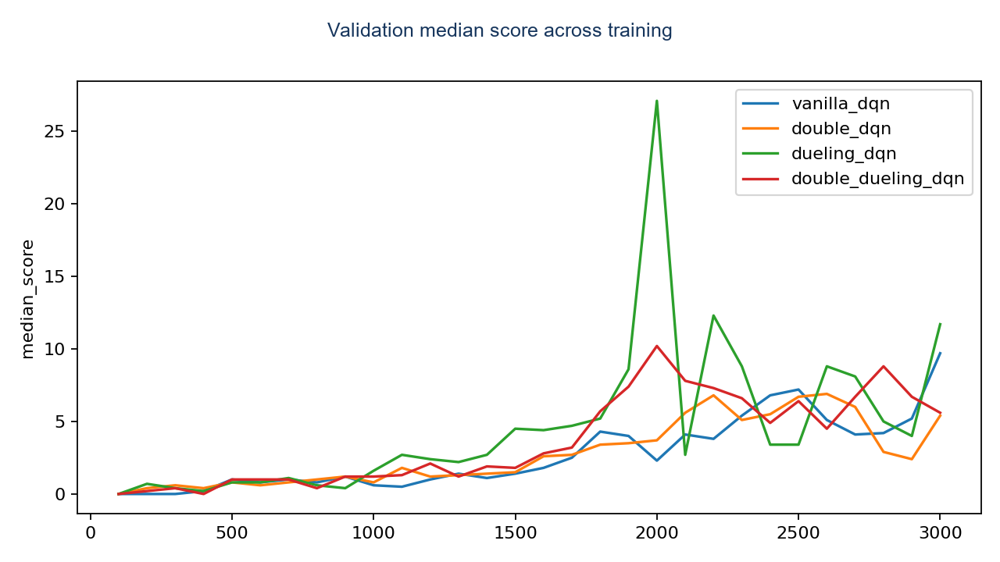

# Intelligent Robotic Systems and Learning-Based Control

This project brings together two related but independent workstreams. The first focuses on robotic software, navigation, and team-based physical deployment. The second focuses on learning-based control and evidence-driven DQN evaluation. They do not describe one combined ROS and Flappy Bird system. Together, they show how I implement, diagnose, evaluate, and document intelligent systems.

## Key outcomes

- I implemented a nine-goal multi-waypoint navigation sequence in my ROS1 Gazebo simulation using the `move_base` action interface. Terminal evidence records success for all nine goals.
- Our team completed a TurtleBot3 Burger physical deployment with ROS2 Humble and Cartographer. I contributed to assembly, hardware preparation, network troubleshooting, robot-to-PC communication, mapping-data work, and key mapping and goal-point movement operations.
- I independently completed the DQN course implementation and experimental workflow for FlappyBird-v0. Later controlled studies compared observation choices, training budget, and four DQN structures with fixed seeds, validation-selected checkpoints, and held-out tests.
- In the algorithm-structure ablation, Dueling DQN achieved the highest five-run mean success rate, 62.2%, under the tested raw_4frame configuration. The result is descriptive rather than a universal algorithm recommendation.

## My contributions

- Implemented ROS1 LiDAR obstacle-avoidance logic and a `move_base` multi-waypoint client in a personal simulation environment.
- Contributed concrete robotics integration work within the team physical deployment. The team, not I alone, completed the physical experiment.
- Implemented the DQN agent and experiment workflow, then designed controlled comparisons with seed control, validation-based checkpoint selection, held-out testing, and run-level summaries.

## Workstream A: Robotics systems

The robotics workstream separates personal ROS1 simulation from team physical deployment. It covers ROS1, ROS2 context, Gazebo, RViz, TurtleBot3, LiDAR processing, navigation, mapping context, and evidence-aware result reporting.

- [ROS1 simulation](docs/ROS1%20%E4%BB%BF%E7%9C%9F%E8%AF%B4%E6%98%8E%20ROS1%20Simulation.md)
- [Team physical deployment](docs/%E5%B0%8F%E7%BB%84%E7%9C%9F%E6%9C%BA%E8%B4%A1%E7%8C%AE%20Team%20Physical%20Deployment.md)
- [Code attribution](docs/%E4%BB%A3%E7%A0%81%E6%9D%A5%E6%BA%90%E4%B8%8E%E5%BD%92%E5%B1%9E%20Code%20Attribution.md)

## Workstream B: Learning-based control

The DQN workstream keeps historical course artifacts, standardized checkpoint re-evaluation, observation studies, feature diagnostics, training-budget evidence, and algorithm ablation separate. It uses Flappy Bird Gymnasium as a third-party environment and does not claim that the DQN variants are novel algorithms.

### Controlled algorithm-ablation figures

The ten figures below describe the fixed `raw_4frame`, 3,000-episode comparison. Each variant has five paired training seeds; the final evaluation uses a held-out set, while validation determines the checkpoint. The plots are descriptive rather than significance tests.

#### Final-test performance and seed-level variation

*Final-test success-rate distributions across the five training runs. The boxplot shows cross-run variation for each DQN variant.*

*The same success-rate results, connected by matched training seed, so that seed-specific differences remain visible.*

*Final-test mean-score distributions across the five training runs.*

*The same mean-score results, connected by matched training seed.*

#### Complexity, training cost, and validation behaviour

*Trainable-parameter counts make the model-complexity trade-off explicit.*

*Mean wall-clock training time across the same five runs, reported in seconds.*

*Area under the validation success-rate curve. Its unit is training episode × success rate, so it is an accumulated learning-progress measure rather than a probability in the conventional 0–1 AUC range.*

*Validation success-rate trajectories across training. This supports the accumulated validation measure above without replacing final held-out evaluation.*

*Validation median-score trajectories across training, shown separately from success rate because the two measures capture different aspects of control quality.*

*Median checkpoint episode selected by validation for each DQN variant; this is a selection diagnostic, not a final-test performance ranking.*

- [DQN system](docs/DQN%20%E7%B3%BB%E7%BB%9F%E8%AF%B4%E6%98%8E%20DQN%20System.md)
- [Training and evaluation](docs/DQN%20%E8%AE%AD%E7%BB%83%E4%B8%8E%E8%AF%84%E4%BC%B0%20DQN%20Training%20and%20Evaluation.md)
- [Ablation study](docs/DQN%20%E6%B6%88%E8%9E%8D%E5%AE%9E%E9%AA%8C%20DQN%20Ablation%20Study.md)
- [Final experimental report](docs/DQN%20%E6%9C%80%E7%BB%88%E5%AE%9E%E9%AA%8C%E6%8A%A5%E5%91%8A%20DQN%20Final%20Experimental%20Report.md)

## Technical stack

ROS1 Melodic, ROS2 Humble, Gazebo, RViz, TurtleBot3, `move_base`, Cartographer context, Python, Gymnasium, PyTorch, DQN, Double DQN, Dueling DQN, frame stacking, seeded evaluation, and controlled ablation.

## Project structure

- `src/`: ROS1 package files and the documented public DQN source subset.
- `configs/`: simulation maps and public DQN configuration snapshots.
- `results/`: result summaries and machine-readable DQN CSVs.
- `figures/`: CSV-derived DQN figures and selected redacted robotics evidence.
- `docs/`: technical explanations, attribution, reproducibility notes, evidence, limitations, and public-safety records.

## Evidence and limits

The ROS1 result is a simulation result. The physical deployment is team-based and does not claim a continuous autonomous target-selection-to-arrival record. Historical DQN results, standardized checkpoint re-evaluation, and later controlled extensions are reported as distinct evidence streams. Details are in [Evidence](docs/%E8%AF%81%E6%8D%AE%E6%B8%85%E5%8D%95%20Evidence.md) and [Limitations](docs/%E5%B1%80%E9%99%90%E4%B8%8E%E5%BE%85%E5%8A%9E%20Limitations.md).
