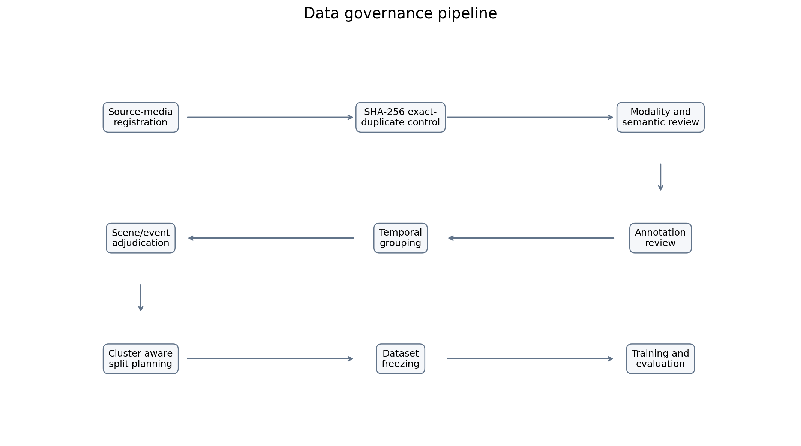
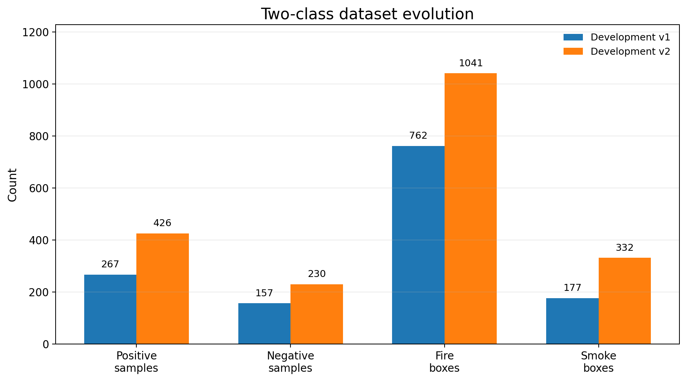
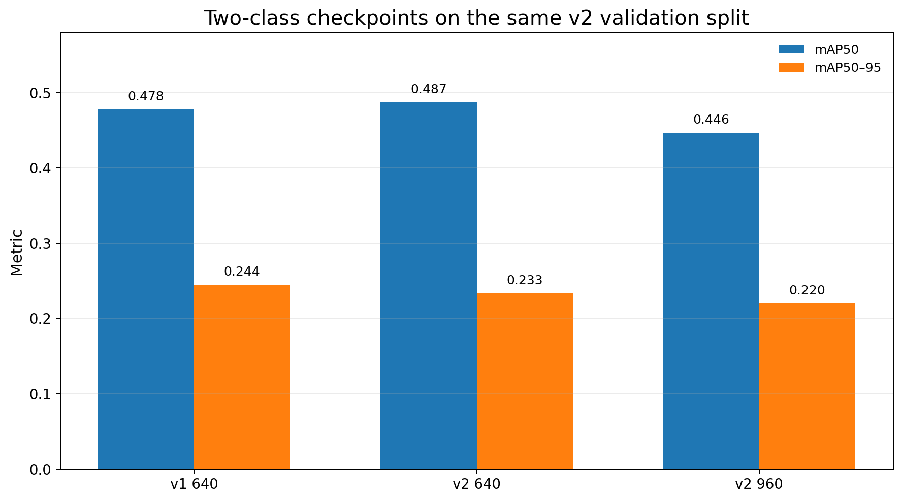
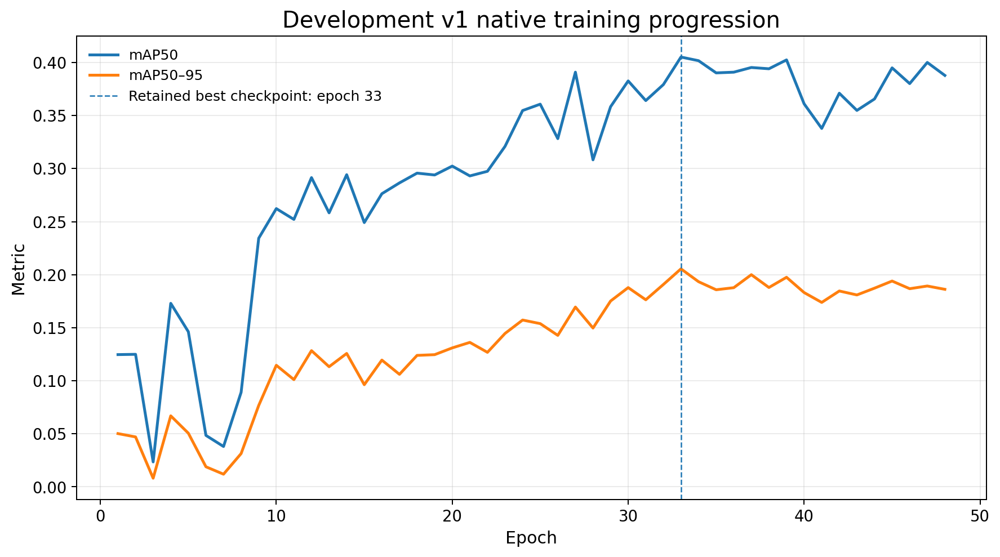
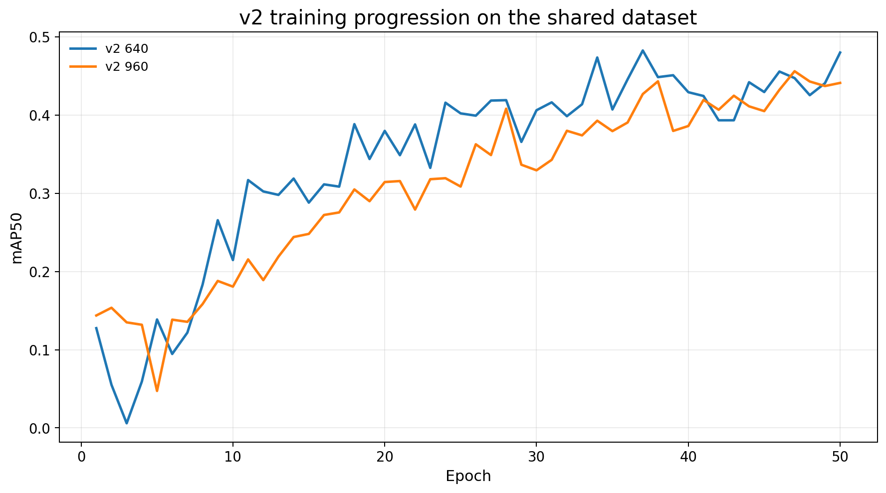
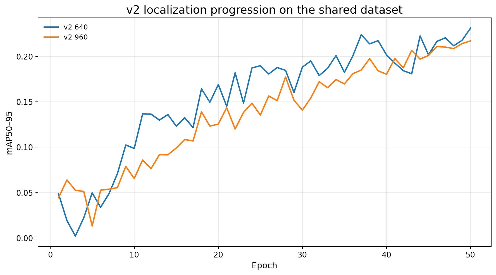

# Fire and Smoke Detection for Forest Monitoring

*An evidence-led portfolio project covering a current two-class engineering workflow and a separate archived five-class YOLO11 comparison.*

## Project overview

This project contains two related but non-comparable evidence scopes.

| Evidence scope | Label space | Purpose | Evaluation boundary |
|---|---|---|---|
| Current engineering development | `fire`, `smoke` | Data governance, baseline development, difficult-target diagnosis, and next-stage planning | Three retained checkpoints evaluated on the same v2 validation split |
| Archived experimental study | `fire`, `smoke`, `animal`, `person`, `vehicle` | Audit of Standard versus From3Class YOLO11 initialization | One archived validation run per condition |

The datasets, label spaces, split histories, and experimental protocols differ. Metrics from the two scopes should not be compared directly.

---

# Part I — Current two-class engineering development

## Engineering objective

The current development track asks a practical question:

> How should a fire/smoke detector be improved when aggregate metrics can rise while smoke recall and localization quality decline?

The workflow therefore treats data governance, class-specific behavior, scene/event independence, and difficult-target review as part of model development rather than relying on one aggregate score.

## Data governance and dataset evolution

The retained workflow includes source-media registration, SHA-256 exact-duplicate control, modality and semantic review, annotation review, temporal grouping, scene/event adjudication, and cluster-aware split planning.



Two retained dataset manifests support the following development snapshots:

| Dataset | Total | Train | Validation | Test-designated | Positive | Negative | Fire boxes | Smoke boxes |
|---|---:|---:|---:|---:|---:|---:|---:|---:|
| Development v1 | 424 | 296 | 86 | 42 | 267 | 157 | 762 | 177 |
| Development v2 | 656 | 457 | 132 | 67 | 426 | 230 | 1,041 | 332 |



These counts document retained development manifests. They do not constitute a public dataset release, and the test-designated subsets are not presented as independently audited benchmarks. A formal scene/event freeze for every retained version is not claimed.

## Same-split checkpoint evaluation

For a controlled checkpoint comparison, the retained v1, v2-640, and v2-960 `best.pt` checkpoints were evaluated on the same v2 validation split.

| Checkpoint | Selected checkpoint epoch | Precision | Recall | mAP50 | mAP50-95 |
|---|---:|---:|---:|---:|---:|
| Development v1 — 640 | 33 | 0.5738 | 0.4640 | 0.4777 | 0.2443 |
| Development v2 — 640 | 50 | 0.5621 | 0.4810 | 0.4868 | 0.2334 |
| Development v2 — 960 | 50 | 0.5264 | 0.4883 | 0.4463 | 0.2196 |



The v2-640 checkpoint increased mAP50 by 0.0091 relative to v1, but mAP50-95 decreased by 0.0109. The v2-960 checkpoint recorded lower mAP50 and mAP50-95 than v2-640. Input resolution alone therefore did not produce a stronger overall result.

The retained v1 training record contains 48 completed epochs from a requested 50; its selected checkpoint corresponds to epoch 33. The table above uses coherent checkpoint evaluations rather than combining the strongest value of each metric from different epochs.

## Per-class behavior

The same-split class results explain why overall recall alone is insufficient.

| Checkpoint | Fire recall | Smoke recall | Fire mAP50-95 | Smoke mAP50-95 |
|---|---:|---:|---:|---:|
| Development v1 — 640 | 0.4897 | 0.4384 | 0.2527 | 0.2358 |
| Development v2 — 640 | 0.5648 | 0.3973 | 0.2542 | 0.2125 |
| Development v2 — 960 | 0.6204 | 0.3562 | 0.2852 | 0.1540 |


From v1 to v2-640, fire recall increased by 0.0751 while smoke recall decreased by 0.0411. Moving from v2-640 to v2-960 increased fire recall again but reduced smoke recall by another 0.0411. The higher overall recall at 960 is therefore driven by fire rather than a uniform improvement across both classes.

Because the development objective includes smoke sensitivity and localization quality, v1 remains the retained development baseline at this snapshot.

## Training progression

The v1 curve below is its native training history on the v1 dataset and should not be interpreted as a same-split curve against v2.



The two v2 runs used the same dataset, so their native training curves can be compared more directly:





Training-time curve maxima are not substituted for the checkpoint evaluations reported above. A public long-format CSV is provided so the plotted progression remains inspectable.

## Targeted small and distant smoke review

A targeted review screened 396 candidate samples:

| Outcome | Count |
|---|---:|
| Positive | 15 |
| Negative | 237 |
| Ambiguous | 14 |
| Excluded | 130 |

The 15 positives consisted of 10 clear full-view cases and 5 zoom-dependent cases, with 16 retained smoke boxes. The positive yield was approximately 3.8%.


A separate 40-image Pyro-SDIS pilot produced no usable positive sample. Continued expansion from that source was stopped as a positive-yield engineering decision rather than continued without evidence of value.

## Error-analysis boundary

The retained diagnostic materials include full-image, crop-based, and tiled-inference analysis. However, the formal A–E category definitions and denominator are not fully reconciled: one retained summary reports A=16, B=11, C=0, D=3, and E=4, while a separate note mentions seven visually ambiguous or information-insufficient targets without establishing whether they overlap.

No A–E distribution is therefore published here. The only supported public conclusion is narrower: the 960-pixel experiment did not resolve the retained small/distant-smoke limitation, and additional data review was more informative than assuming resolution alone would solve it.

## Scene and event independence

The workflow reviews temporal proximity, repeated camera views, physical-event overlap, and conservative scene/event clusters before split planning. Retained evidence confirms that a 24-group novelty adjudication was completed, but it does not establish final formal acceptance or dataset freezing.

These controls reduce leakage risk; they do not prove that every retained split is an independent benchmark.

## Current status and roadmap

**Completed**

- Two-class YOLO11s development runs at v1-640, v2-640, and v2-960.
- Same-v2-validation checkpoint comparison.
- Targeted small/distant-smoke review.
- Pyro-SDIS pilot closeout.
- Scene/event and novelty-review work retained as development evidence.

**Not yet evidenced as complete**

- Formal diversity-24 acceptance and freeze.
- A frozen development-v3 dataset.
- Development-v3 training.
- Video-level evaluation.
- Temporal confirmation, confidence hysteresis, and alert cooldown.
- Deployment readiness.

**Planned model evaluation sequence**

1. YOLO26s as the next baseline.
2. D-FINE-S as a cross-architecture challenge.
3. RT-DETRv2-S as a stable Transformer comparison.

No result is claimed for these later models until retained training and evaluation evidence is available.

## Reproducibility and publication boundary

The public two-class materials include sanitized aggregate tables, per-class metrics, dataset statistics, training curves, and figure-generation code. They do not include source media, labels, model weights, review databases, internal paths, credentials, or unreviewed qualitative images.

The figures can be rebuilt from the public CSV files:

```powershell
python src\build_two_class_figures.py
```

The public script rebuilds figures only. It does not train, validate, or run inference.

---

# Part II — Archived five-class YOLO11 comparison

## Archived project overview

The archived study is an evidence-led reconstruction of object-detection experiments in a five-class forest-monitoring setting. Its classes are `fire`, `smoke`, `animal`, `person`, and `vehicle`. It is therefore separate from the current two-class engineering workflow and is not an operational fire-warning system.

The public materials were rebuilt from archived training records after an audit of run configurations and metric CSV files. They intentionally contain no dataset, image, label, video, model weight, original training source code, or internal path. The archived Python source was reported as binary-contaminated and no trusted clean backup was available. The existing [`src/build_figures.py`](src/build_figures.py) script regenerates archived-study figures from public CSV files; it does not train or evaluate a YOLO model.

## Archived experimental question

> Under the archived training setup, how did a standard YOLO11s initialization compare with continued training from a three-class checkpoint after moving to a five-class dataset?

The evidence supports a partially controlled, single-run archived comparison, not a universal ranking. Both conditions requested 50 epochs with image size 640, batch size 16, seed 0, and the same archived five-class dataset path. The Standard condition started from `yolo11s.pt`; From3Class continued from an archived three-class checkpoint. The differing initialization and resume state prevent a strict controlled-ablation claim.

## Archived dataset scope and governance

The archived clean dataset contains 22,899 images and matching YOLO label files:

| Split | Images |
|---|---:|
| Train | 16,459 |
| Validation | 2,002 |
| Test-designated | 4,438 |

No independently audited evaluation record for the test-designated split was found. All archived-study values reported here come from configurations marked `split: val`. Data are not released because source licenses, merged-data provenance, redistribution rights, and privacy review are incomplete. Person and vehicle imagery may contain faces, licence plates, or surveillance contexts. See [data governance](docs/data_governance.md).

## Archived training conditions

The archived configurations identify YOLO11. Sanitized conditions are available in [results/training_conditions.csv](results/training_conditions.csv) and [tables/training_conditions.md](tables/training_conditions.md).

Supplementary read-only evidence identifies a retained Linux GPU Docker environment with two RTX 4090 GPUs, Python 3.12.3, PyTorch 2.11.0+cu128, CUDA 12.8, cuDNN 9.19.0.56, and Ultralytics 8.4.90. These values document retained infrastructure, not complete training reproducibility.

## Archived validation results

The pre-declared rule is to report, for each condition, the epoch with the highest archived validation mAP50-95. This avoids mixing peak values from different epochs.

| Condition | Selected epoch | Precision | Recall | Validation mAP50 | Validation mAP50-95 |
|---|---:|---:|---:|---:|---:|
| Standard | 40 | 0.58295 | 0.53123 | 0.53969 | 0.31296 |
| From3Class | 40 | 0.63734 | 0.53157 | 0.56365 | 0.32864 |

For this selection rule, From3Class records higher validation precision and mAP values; recall differs little. With one archived run per condition and no verified evaluation of the test-designated split, the initialization is treated as promising in this setup rather than generally superior.


At epoch 50, Standard records precision 0.62883, recall 0.50296, mAP50 0.53512, and mAP50-95 0.30997. From3Class records precision 0.63911, recall 0.52584, mAP50 0.54876, and mAP50-95 0.31786. Both best-epoch and final-epoch values remain available in [tables/validation_results.md](tables/validation_results.md).


## Archived interpretation boundary

The archived results contain one recorded run per condition. No repeated-seed summary, uncertainty interval, or independent test-designated-split evaluation is available. The appropriate interpretation is limited to the surviving records.

A small metric difference is difficult to interpret when evaluation protocol, repeated runs, environment versions, and data provenance are incomplete. The public version preserves that uncertainty rather than presenting the strongest number without context.

## Archived reproducibility boundary

The archived public CSV files preserve audited aggregate and per-epoch metrics and can regenerate their figures:

```powershell
python -m pip install -r requirements.txt
python src\build_figures.py
```

This does not reproduce model training. Original dataset construction, source code, checkpoint lineage, and independent test-designated-split evaluation remain outside the reproducible scope. A clean-room route is described in [docs/reconstruction_plan.md](docs/reconstruction_plan.md).

---

## Repository guide

### Current two-class development

- [`results/two_class_checkpoint_metrics.csv`](results/two_class_checkpoint_metrics.csv): coherent checkpoint results on the same v2 validation split.
- [`results/two_class_per_class_metrics.csv`](results/two_class_per_class_metrics.csv): fire/smoke precision, recall, mAP50, and mAP50-95.
- [`results/two_class_dataset_statistics.csv`](results/two_class_dataset_statistics.csv): retained v1/v2 dataset counts.
- [`results/two_class_training_curves.csv`](results/two_class_training_curves.csv): long-format native training histories.
- [`results/two_class_targeted_smoke_review.csv`](results/two_class_targeted_smoke_review.csv): targeted review outcomes.
- [`src/build_two_class_figures.py`](src/build_two_class_figures.py): rebuilds current-development figures from public CSV files.
- [`docs/two_class_development_scope.md`](docs/two_class_development_scope.md): evidence and non-claim boundaries.

### Archived five-class study

- [`results/`](results/): audited validation tables and per-epoch metrics.
- [`figures/`](figures/): figures regenerated from public CSV files.
- [`tables/`](tables/): readable condition, result, and evidence summaries.
- [`docs/experiment_scope.md`](docs/experiment_scope.md): archived scope and non-claims.
- [`docs/methodology.md`](docs/methodology.md): metric-selection and audit method.
- [`docs/data_governance.md`](docs/data_governance.md): data, privacy, and leakage boundary.
- [`docs/contribution_scope.md`](docs/contribution_scope.md): evidence-based attribution boundary.
- [`docs/reproducibility.md`](docs/reproducibility.md): what the archived study can and cannot reproduce.
